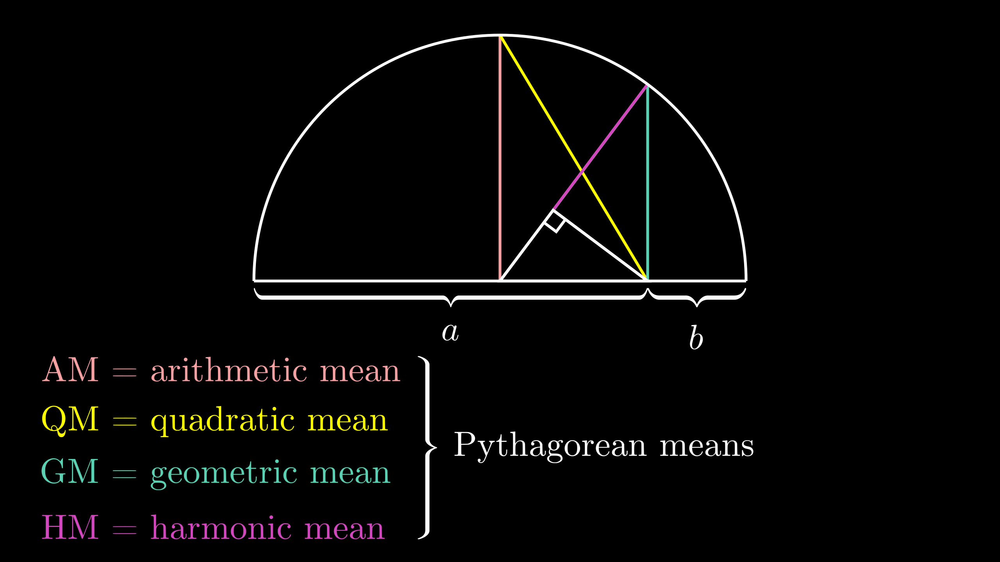

# My Manim Animations
Here you will find my math/physics animations made in [Manim](https://github.com/3b1b/manim "Grant's version")/[CE](https://github.com/ManimCommunity/manim 'Community Edition').

## Fourier Series Drawings

## Fractal Draw

## Pythagorean Means

## Voyager Hydrogen

